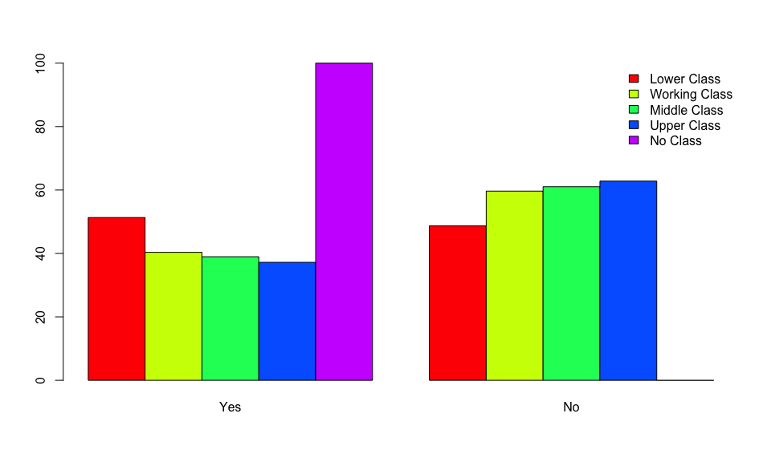
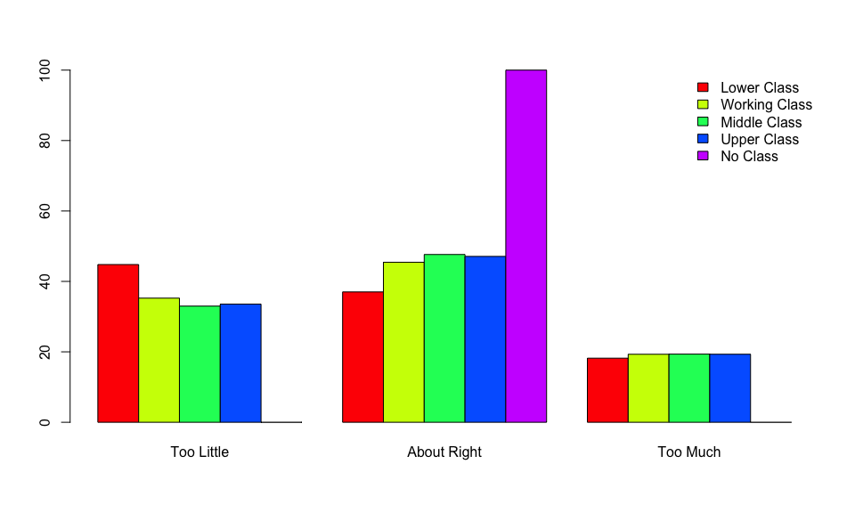
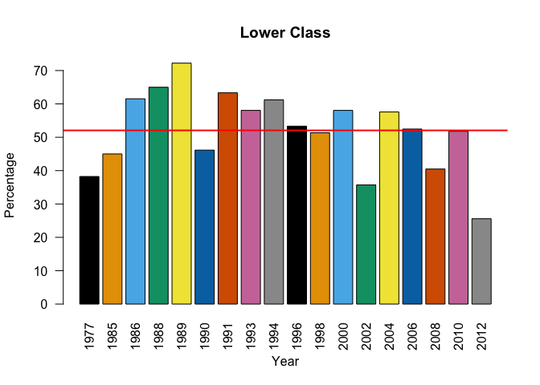
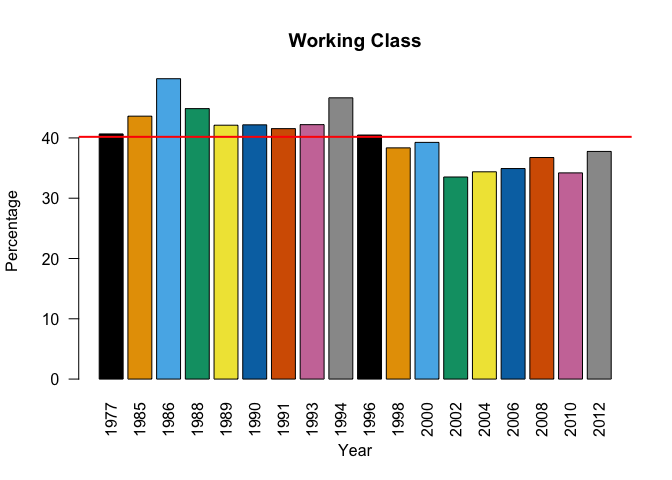
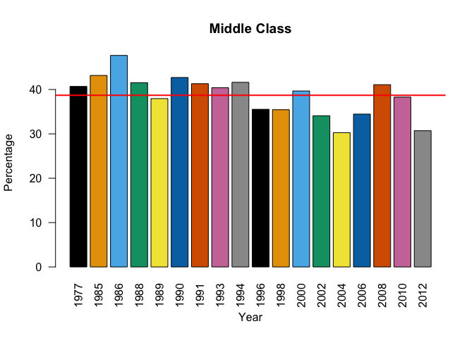
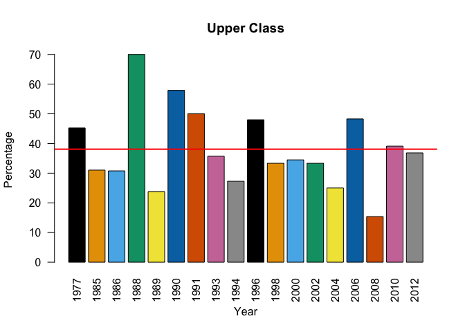

Statistical inference with the GSS data
================

## Setup

### Load packages

``` r
library(ggplot2)
library(dplyr)
library(statsr)
```

### Load data

Make sure your data and R Markdown files are in the same directory. When
loaded your data file will be called `gss`. Delete this note when before
you submit your work.

``` r
load("gss.Rdata")
```

-----

## Part 1: Data

### Background

This project uses an extract of the General Social Survey (GSS)
Cumulative File 1972-2012. <br/><br/> The General Social Survey (GSS) is
a nationally representative survey of adults in the United States
conducted since 1972. The GSS collects data on contemporary American
society in order to monitor and explain trends in opinions, attitudes
and behaviors. The GSS has adopted questions from earlier surveys which
allows researchers to conduct comparisons for up to 80 years. <br/> The
GSS contains a standard core of demographic, behavioral, and attitudinal
questions, plus topics of special interest. Among the topics covered are
civil liberties, crime and violence, intergroup tolerance, morality,
national spending priorities, psychological well-being, social mobility,
and stress and traumatic events.

### History

The GSS was first conducted in 1972. Until 1994, it was conducted almost
annually (with the exceptions of the years 1979, 1981, and 1992). Since
1994, the GSS has been conducted in even numbered years. In 2006, a
large part of the GSS was administered in Spanish for the first time.

### Methodology

The target population of the GSS is adults (18+) living in households in
the United States. The GSS sample is drawn using an area probability
design that randomly selects respondents in households across the United
States to take part in the survey. Respondents that become part of the
GSS sample are from a mix of urban, suburban, and rural geographic
areas. Participation in the study is strictly voluntary.<br/> The survey
is conducted face-to-face with an in-person interview by NORC at the
University of Chicago.

### Scope inference

``` r
dim(gss)
```

    ## [1] 57061   114

The study is conducted by random sampling with a good size which makes
the data generalizable to the US adult population.<br/> The GSS is an
observational study with no random assignments that can have an
indication of association among the relationship of the variables of
interest, but not causation.<br/><br/> The GSS is declared unbiased but
it may have a set of constraints that introduce bias as:

<ul>

<li>

Introduce Spanish speakers only in 2006

</li>

<li>

To be a voluntary survey, making it impossible to report those that
decide not to answer it

</li>

</ul>

-----

## Part 2: Research question

Is there a relationship between social class and the belief about black
discrimination? Is this belief changing across the years? How different
social classes see their expenses to improve the conditions of black
people?

After the crimes committed against some black people in 2020 and the big
number of riots against them, using some data is possible to analyze the
opinion about structural racism in the US. The study will compare the
opinion about discrimination against black people per social class and
how that is changed in the last years. It is possible to analyze per
social classes people opinion about their expenses to improve the
conditions of black people in the country.

-----

## Part 3: Exploratory data analysis

First, to decrease the number of columns in the sample, it will keep
only the variables that can give some insight into the study and remove
NaNs.

``` r
# natrace => EXPENCES TO IMPROVING THE CONDITIONS OF BLACKS

# racdif1 => On the average (negroes/blacks/African-Americans) have worse jobs, income, and housing than white people.
# Do you think these differences are: a. Mainly due to discrimination?
columns <- c('year', 'natrace', 'racdif1', 'class')
race <- na.omit(gss[columns])

head(race, 10)
```

    ##      year     natrace racdif1         class
    ## 7591 1977    Too Much      No Working Class
    ## 7592 1977    Too Much      No Working Class
    ## 7593 1977    Too Much      No  Middle Class
    ## 7594 1977 About Right      No Working Class
    ## 7595 1977 About Right      No Working Class
    ## 7596 1977    Too Much      No  Middle Class
    ## 7598 1977    Too Much      No Working Class
    ## 7599 1977 About Right     Yes  Middle Class
    ## 7600 1977  Too Little      No Working Class
    ## 7601 1977  Too Little      No Working Class

To analyze the data distribution:

``` r
table(race$natrace, useNA = 'ifany')
```

    ## 
    ##  Too Little About Right    Too Much 
    ##        3961        5260        2201

``` r
table(race$racdif1, useNA = 'ifany')
```

    ## 
    ##  Yes   No 
    ## 4593 6829

``` r
table(race$class, useNA = 'ifany')
```

    ## 
    ##   Lower Class Working Class  Middle Class   Upper Class      No Class 
    ##           643          5081          5283           414             1

The tables show that majority does not believe in race discrimination
and believe that their expense is `About Right` to improve the
conditions of black people. The majority consider themselves `Middle
Class` or `Working Class`.

Comparing the social classes and the belief about race discrimination:

``` r
df <- round(prop.table(table(race$class, race$racdif1), margin = 1) * 100, 2)
df
```

    ##                
    ##                    Yes     No
    ##   Lower Class    51.32  48.68
    ##   Working Class  40.35  59.65
    ##   Middle Class   38.96  61.04
    ##   Upper Class    37.20  62.80
    ##   No Class      100.00   0.00

``` r
barplot(df, beside = TRUE, legend = rownames(df), args.legend = list(x = "topright", bty = "n", inset=c(0, 0)), col = rainbow(nrow(df)))
```

<!-- -->

Comparing the social classes and the belief about their expenses into
black people’s conditions:

``` r
df <- round(prop.table(table(race$class, race$natrace), margin = 1) * 100, 2)
df
```

    ##                
    ##                 Too Little About Right Too Much
    ##   Lower Class        44.79       37.01    18.20
    ##   Working Class      35.25       45.44    19.31
    ##   Middle Class       32.99       47.64    19.36
    ##   Upper Class        33.57       47.10    19.32
    ##   No Class            0.00      100.00     0.00

``` r
barplot(df, beside = TRUE, legend = rownames(df), args.legend = list(x = "topright", bty = "n", inset=c(0, 0)), col = rainbow(nrow(df)))
```

<!-- -->

Looking at the data is possible to notice as higher as the social class
less belief in race discrimination and more acceptance with the current
expenses to improve black people’s conditions.

``` r
df <- race
df$Yes <- 0
df[df$racdif1 == 'Yes',]$Yes <- 1
df$No <- 0
df[df$racdif1 == 'No',]$No <- 1

df <- df %>% group_by(year, class) %>%  summarise(Yes = sum(Yes), No = sum(No))
df$Yes_Perc <- round(df$Yes / (df$Yes + df$No) * 100, 2)
df$No_Perc <- round(df$No / (df$Yes + df$No) * 100, 2)

lower <- df %>% filter(class == 'Lower Class') %>% select(year, Yes_Perc)
barplot(height = lower$Yes_Perc, names = lower$year,
        col = palette.colors(nrow(lower)),
        main = "Lower Class", xlab="Year", ylab = 'Percentage', las = 2)
abline(h = mean(lower$Yes_Perc), col = 'red', lwd = 2)
```

<!-- -->

``` r
working <- df %>% filter(class == 'Working Class') %>% select(year, Yes_Perc)
barplot(height = working$Yes_Perc, names = working$year,
        col = palette.colors(nrow(working)),
        main = "Working Class", xlab="Year", ylab = 'Percentage', las = 2)
abline(h = mean(working$Yes_Perc), col = 'red', lwd = 2)
```

<!-- -->

``` r
middle <- df %>% filter(class == 'Middle Class') %>% select(year, Yes_Perc)
barplot(height = middle$Yes_Perc, names = middle$year,
        col = palette.colors(nrow(middle)),
        main = "Middle Class", xlab="Year", ylab = 'Percentage', las = 2)
abline(h = mean(middle$Yes_Perc), col = 'red', lwd = 2)
```

<!-- -->

``` r
upper <- df %>% filter(class == 'Upper Class') %>% select(year, Yes_Perc)
barplot(height = upper$Yes_Perc, names = upper$year,
        col = palette.colors(nrow(upper)),
        main = "Upper Class", xlab="Year", ylab = 'Percentage', las = 2)
abline(h = mean(upper$Yes_Perc), col = 'red', lwd = 2)
```

<!-- -->

``` r
df %>%
  ggplot( aes(x=year, y=Yes_Perc, group=class, color=class)) +
    geom_line()
```

<!-- -->

``` r
df[df$year == 2012,]
```

    ## # A tibble: 4 x 6
    ## # Groups:   year [1]
    ##    year class           Yes    No Yes_Perc No_Perc
    ##   <int> <fct>         <dbl> <dbl>    <dbl>   <dbl>
    ## 1  2012 Lower Class      11    32     25.6    74.4
    ## 2  2012 Working Class    91   150     37.8    62.2
    ## 3  2012 Middle Class     78   176     30.7    69.3
    ## 4  2012 Upper Class       7    12     36.8    63.2

Observing all data per year is possible to see that the belief of race
discrimination is decreasing during the last years.

-----

## Part 4: Inference

<span style="font-size: 12px; font-weight: bold;">This section executes
a statistical inference via hypothesis testing following the steps
below:</span>

<ul>

<li>

State hypotheses

</li>

<li>

Check conditions

</li>

<li>

Methodology

</li>

<li>

Perform inference

</li>

<li>

Interpret results

</li>

</ul>

### Is there a relationship between social class and the belief about black discrimination?

#### State hyphoteses

<span style="font-weight: bold;">Null Hypothesis (Ho): </span> The
belief of discrimination against black people and social class are
independent.<br/> <span style="font-weight: bold;">Alternative
Hypothesis (Ha): </span> The belief of discrimination against black
people and social class are dependent.<br/>

#### Check conditions

<span style="font-weight: bold;">Independence: </span> The GSS dataset
is generated from a random sample survey with a size below 10% of the
population. Because of that is possible to assume independence in this
data sample.<br/> <span style="font-weight: bold;">Expect count: </span>
There are at least 5 elements per cell except in `No Class` which will
be removed from this study.<br/>

``` r
table(race$class, race$racdif1)
```

    ##                
    ##                  Yes   No
    ##   Lower Class    330  313
    ##   Working Class 2050 3031
    ##   Middle Class  2058 3225
    ##   Upper Class    154  260
    ##   No Class         1    0

Remove `No Class`

``` r
df <- race[race$class != 'No Class',]
df <- droplevels(df)
table(df$class, df$racdif1)
```

    ##                
    ##                  Yes   No
    ##   Lower Class    330  313
    ##   Working Class 2050 3031
    ##   Middle Class  2058 3225
    ##   Upper Class    154  260

#### Methodology

The dataset consists of two categorical variables `class` (social class)
and `racdif1` (belief of race discrimination), with a categorical
variable with more than 2 levels and another with 2 levels. Because of
those characteristics, the method adopted is a chi-square test of
independence. This is the method adopted when comparing 2 categorical
variables and at least one has more than 2 levels.

#### Perform inference

``` r
chisq.test(df$class, df$racdif1)
```

    ## 
    ##  Pearson's Chi-squared test
    ## 
    ## data:  df$class and df$racdif1
    ## X-squared = 38.087, df = 3, p-value = 2.71e-08

#### Interpret results

With a p-value of almost zero, there is have strong evidence to reject
the null hypothesis. Then is possible to conclude that exists a
dependency between social class and the belief of race discrimination.
With that is possible to assume an indication of association among the
relationship of the variables of interest, but not causation.

<br/>

### How different social classes see their expenses to improve the conditions of black people?

#### State hyphoteses

<span style="font-weight: bold;">Null Hypothesis (Ho): </span> The
expenses to improve the conditions of black people and social class are
independent.<br/> <span style="font-weight: bold;">Alternative
Hypothesis (Ha): </span> The expenses to improve the conditions of black
people and social class are dependent.<br/>

#### Check conditions

<span style="font-weight: bold;">Independence: </span> The GSS dataset
is generated from a random sample survey with a size below 10% of the
population. Because of that is possible to assume independence in this
data sample.<br/> <span style="font-weight: bold;">Expect count: </span>
There are at least 5 elements per cell except in `No Class` which will
be removed from this study.<br/>

``` r
table(race$class, race$natrace)
```

    ##                
    ##                 Too Little About Right Too Much
    ##   Lower Class          288         238      117
    ##   Working Class       1791        2309      981
    ##   Middle Class        1743        2517     1023
    ##   Upper Class          139         195       80
    ##   No Class               0           1        0

Remove `No Class`

``` r
df <- race[race$class != 'No Class',]
df <- droplevels(df)
table(df$class, df$natrace)
```

    ##                
    ##                 Too Little About Right Too Much
    ##   Lower Class          288         238      117
    ##   Working Class       1791        2309      981
    ##   Middle Class        1743        2517     1023
    ##   Upper Class          139         195       80

#### Methodology

The dataset consists of two categorical variables `class` (social class)
and `natrace` (expenses to improve the conditions of black people), with
both categorical variables with more than 2 levels. Because of those
characteristics, the method adopted is a chi-square test of
independence. This is the method adopted when comparing 2 categorical
variables and at least one has more than 2 levels.

#### Perform inference

``` r
chisq.test(df$class, df$natrace)
```

    ## 
    ##  Pearson's Chi-squared test
    ## 
    ## data:  df$class and df$natrace
    ## X-squared = 39.14, df = 6, p-value = 6.719e-07

#### Interpret results

With a p-value of almost zero, there is have strong evidence to reject
the null hypothesis. Then is possible to conclude that exists a
dependency between social class and their expenses to improve the
conditions of black people. With that is possible to assume an
indication of association among the relationship of the variables of
interest, but not causation.

<br/>
